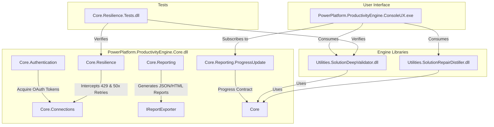

# Power Platform Productivity Engine

A modular, resilient, and extensible suite of productivity utilities for Power Platform (Dataverse) solution management, validation, and automated repair.

---

## Architecture Overview

The solution is divided into reusable class libraries (DLLs) and a console user interface, allowing the core business logic to be consumed by any UX runner (such as Console CLI, .NET MAUI mobile/desktop apps, or Blazor web frontends).



### Components

1. **`PowerPlatform.ProductivityEngine.Core`** (Class Library):
   - Multi-tenant MSAL authentication & token caching.
   - Resilient HTTP clients using Semaphore-locked 429 rate limit handling and exponential backoffs.
   - HTML/JSON reporting pipelines and decoupled progress reporting contracts.

2. **`Utilities.SolutionDeepValidator`** (Class Library):
   - Modular validation framework running 19 deep checkers against target environment metadata.
   - Paged 11-source target environment metadata cache utilizing `@odata.nextLink` (5000 items per page).
   - In-memory solution package ZIP extraction and inspection.

3. **`Utilities.SolutionRepairDistiller`** (Class Library):
   - Direct-to-server OOB table bloat distillation (removes and re-adds components with `DoNotIncludeSubcomponents = true`).
   - Local XML corruption repair (regex-based sanitization of namespaces, invalid chars, and tag braces in `solution.xml`/`customizations.xml`).
   - Automated repair executor addressing missing dependencies on source and unmanaged active layers on target.

4. **`PowerPlatform.ProductivityEngine.ConsoleUX`** (Console CLI Application):
   - The primary command-line runner. Resolves inputs, runs subcommands, and listens to progress logs to output thread-safe colorized status updates.

5. **`Core.Resilience.Tests`** (xUnit Tests):
   - Throttling retry resilience, crawler paging, and validator rule unit tests.

---

## Real-Time Progress Reporting

All engines accept a .NET standard `IProgress<ProgressUpdate>` instance. Status updates are published dynamically, allowing developers to integrate spinners, progress bars, or remote monitoring logs without modifying the library source.

---

## Subcommand Usage Guide

### 1. Solution Validation (`validate`)
Validates a solution package (local ZIP or fetched from source) against a target Dataverse environment.
```powershell
# Run validation demo simulation (creates JSON/HTML reports)
dotnet run --project PowerPlatform.ProductivityEngine.ConsoleUX -- validate --simulate

# Validate a local ZIP file against a target environment
dotnet run --project PowerPlatform.ProductivityEngine.ConsoleUX -- validate --zip "C:\path\to\solution.zip" --url "https://myorg.crm.dynamics.com" --interactive

# Download from source environment, parse validation log, and validate against target
dotnet run --project PowerPlatform.ProductivityEngine.ConsoleUX -- validate --src-url "https://source.crm.dynamics.com" --solution "MySolution" --url "https://target.crm.dynamics.com" --validation-log "C:\path\to\ImportFailedLog.zip" --interactive
```

### 2. Solution Distillation (`distill`)
Cleans bloated OOB tables directly on the server or repairs corrupt XMLs in a local solution package.
```powershell
# Run distillation simulation
dotnet run --project PowerPlatform.ProductivityEngine.ConsoleUX -- distill --simulate

# Distill OOB table bloat on a live source environment
dotnet run --project PowerPlatform.ProductivityEngine.ConsoleUX -- distill --url "https://source.crm.dynamics.com" --solution "MySolution" --interactive

# Repair XML corruptions (syntax, brackets, duplicates) in a local ZIP file
dotnet run --project PowerPlatform.ProductivityEngine.ConsoleUX -- distill --zip "C:\path\to\solution.zip" --out-zip "C:\path\to\repaired_solution.zip"
```

### 3. Programmatic Repairs (`repair`)
Parses a validation JSON report and executes target active layer removals or source dependency inclusions.
```powershell
# Run repair simulation
dotnet run --project PowerPlatform.ProductivityEngine.ConsoleUX -- repair --report validation_report.json --simulate

# Run repairs against live environments
dotnet run --project PowerPlatform.ProductivityEngine.ConsoleUX -- repair --report validation_report.json --url "https://target.crm.dynamics.com" --src-url "https://source.crm.dynamics.com" --solution "MySolution" --interactive
```

---

## Getting Started

### Prerequisites
- .NET 8.0 SDK or newer
- PowerShell (optional, for scripts)

### Build & Run
```powershell
# Restore and build the solution
dotnet build

# Run unit tests
dotnet test
```
