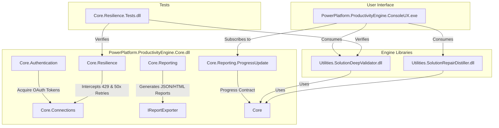

# Power Platform Productivity Engine

A modular, resilient, and extensible suite of productivity utilities for Microsoft Power Platform (Dataverse) solution management, deep validation, and automated repair.

---

## ⚡ Benefits & Time Savings

By automating the validation and repair steps of Dataverse solutions, this engine significantly reduces manual developer overhead and deployment downtime:

### 🔍 Solution Deep Validator - Before deployment attempts to target environment and waiting for hours!
* **Eliminate Log Diagnostics (Saves ~1–2 hours per failure)**: Pinpoints the exact missing tables, columns, option sets, or web resources in seconds, replacing generic platform import failure screens.
* **Proactive Conflict Avoidance**: Detects schema mismatches (e.g. data type mismatches, string length reductions) and publisher conflicts *prior* to import, preventing accidental data truncation on target environments.
* **Verify Customization Locks**: Instantly checks target environments for managed property locks (`IsCustomizable=false`), ensuring your import is verified before deployment begins.

### 🔧 Solution Repair Distiller
* **Automated Package Optimization (Saves ~30–45 mins per build)**: Distills out-of-the-box (OOB) table bloat directly on the server by applying `DoNotIncludeSubcomponents = true`, reducing solution package sizes by up to 80% for faster uploads.
* **Instantly Repair Corrupted XML (Saves ~30 mins per occurrence)**: Automatically scans local ZIP packages and repairs syntax bracket overlaps, malformed tags, and duplicate namespaces in `solution.xml`/`customizations.xml` without requiring manual text editing.
* **Bulk Unmanaged Layer Sanitization**: Programmatically identifies and removes active unmanaged layers on target forms and workflows, eliminating the need to manually click "Remove Customizations" for dozens of components.

---

## 🛠️ Architecture Overview

The codebase is engineered with strict separation of concerns, decoupling core business logic and API orchestration into reusable class libraries (DLLs) from the Console CLI runner. This ensures the engine can easily be consumed by future frontends (such as .NET MAUI desktop/mobile clients or Blazor web applications).



### Decoupled Core Components

1. **`PowerPlatform.ProductivityEngine.Core`** (Class Library):
   * **Multi-Tenant Authentication**: Integrated MSAL-based interactive and silent OAuth token acquisition with secure caching.
   * **API Resilience Pipeline**: Implements custom HTTP handlers with a `SemaphoreSlim`-locked 429 rate limit resolver and exponential backoffs (handling Dataverse API throttling gracefully).
   * **Unified Reporting Pipeline**: Direct-to-file serializations of issues into standardized JSON reports and responsive, self-contained HTML dashboards.
   * **Dynamic Progress Reporting**: Publishes execution metrics, statuses, and steps via .NET standard `IProgress<ProgressUpdate>` callbacks.

2. **`Utilities.SolutionDeepValidator`** (Class Library):
   * **In-Memory Crawler**: Extracts target environment metadata recursively, checking against local solution package contents.
   * **Paged OData Fetcher**: Enforces paged queries using `@odata.nextLink` (5,000 items per page) across 11 system metadata sources to prevent gateway timeouts.
   * **19 Deep Validation Checkers**: Compiles raw system metrics and structural schemas into actionable error and warning logs.

3. **`Utilities.SolutionRepairDistiller`** (Class Library):
   * **Local XML Preprocessor**: Regex-based syntax repair of namespaces, invalid tag braces, and malformed tags in `solution.xml`/`customizations.xml`.
   * **OOB Table Bloat Distillation**: Removes and re-adds out-of-the-box (OOB) entities with `DoNotIncludeSubcomponents = true` to shrink deployment payloads.
   * **Programmatic Repair Executor**: Executes `RemoveActiveCustomizations` against target environments to clean up active layer overlaps, and updates source packages using `AddSolutionComponent`.

4. **`PowerPlatform.ProductivityEngine.ConsoleUX`** (CLI Application):
   * Provides thread-safe, colorized terminal outputs using custom CLI commands.

---

## 🔍 The 19 Deep Validation Checkers

The deep validator implements 19 specialized C# validation classes verifying the target environment's compatibility:

| # | Validator Name | Issue IDs Checked | Description & Logical Checks |
|---|----------------|-------------------|------------------------------|
| **1** | **Solution Version** | `PENDING_UPGRADE`<br>`VERSION_DOWNGRADE`<br>`SAME_VERSION`<br>`MANAGED_INTO_UNMANAGED` | Checks for pending upgrades, blocks version downgrades, warns on identical version overwrite, and blocks importing managed packages over unmanaged configurations. |
| **2** | **Missing Dependency** | `MISSING_DEPENDENCY`<br>`INTERNAL_UNMANAGED`<br>`UNMANAGED_DEPENDENCY`<br>`EXPECTED_MISSING` | Scans required dependencies (Entities, Attributes, Web Resources, Processes) and flags missing components in the target or active layers. |
| **3** | **Entity Validator** | `MISSING_ENTITY`<br>`MISSING_LOOKUP_TARGET` | Verifies the existence of out-of-the-box system tables on the target and validates that lookup columns point to existing destination tables. |
| **4** | **Attribute Validator** | `FORM_MISSING_ATTRIBUTE` | Validates that forms or views in the solution do not reference missing columns on target tables. |
| **5** | **Relationship Validator** | `RELATIONSHIP_MISSING_ENTITY` | Verifies that custom relationships reference tables that exist on the target or are included in the package. |
| **6** | **Option Set Validator** | `MISSING_OPTIONSET` | Checks that local columns referencing global OptionSets (Choices) find their definition in the target environment. |
| **7** | **Schema Conflict** | `ATTRIBUTE_TYPE_MISMATCH`<br>`STRING_LENGTH_REDUCTION`<br>`PRECISION_REDUCTION` | Flags data type mismatches (e.g. text vs number) and warns if max string lengths or decimal precisions are reduced, avoiding data truncation. |
| **8** | **Managed Property** | `ENTITY_NOT_CUSTOMIZABLE`<br>`CANNOT_CREATE_FORMS`<br>`CANNOT_CREATE_VIEWS`<br>`ATTRIBUTE_NOT_CUSTOMIZABLE` | Checks target components for managed customization locks (`IsCustomizable=false`) to ensure imports will not be blocked. |
| **9** | **Component Ownership** | `PUBLISHER_CONFLICT` | Flags if a table/component on target has a publisher prefix that conflicts with the incoming solution's prefix. |
| **10** | **Workflow Validator** | `WORKFLOW_DEPENDENCY`<br>`WORKFLOW_MISSING_ATTRIBUTE` | Validates process definitions to ensure their primary tables exist and they do not reference deleted columns. |
| **11** | **Plugin Validator** | `PLUGIN_ASSEMBLY_EXISTS`<br>`PLUGIN_STEP_MISSING_ENTITY`<br>`PLUGIN_CUSTOM_MESSAGE` | Validates plugin assemblies, step target tables, and flags usage of non-standard platform messages. |
| **12** | **Web Resource** | `WEBRESOURCE_EXISTS`<br>`WEBRESOURCE_MISSING_DEPENDENCY` | Warns if existing web resources will be overwritten and flags missing external JavaScript libraries. |
| **13** | **Security Role** | `SECURITY_ROLE_EXISTS`<br>`SECURITY_ROLE_NEW` | Identifies if a security role will merge privileges on import or create a brand-new role. |
| **14** | **Connection Reference** | `CONNECTION_REF_STANDARD`<br>`MISSING_CONNECTION_REF` | Checks connection reference targets, separating standard platform connectors from custom connectors. |
| **15** | **App Version Validator** | `MISSING_FIRST_PARTY_APP`<br>`APP_VERSION_MISMATCH`<br>`PLATFORM_APPS_INFO` | Verifies prerequisites like first-party Dynamics 365 Apps (e.g. Sales) are present and meet minimum version requirements. |
| **16** | **Environment Variable** | `ENVVAR_NO_VALUE`<br>`ENVVAR_VALUE_TOO_LONG` | Flags environment variables with no default/active value and enforces the platform limit of 2,000 characters. |
| **17** | **App Action Validator** | `APPACTION_MISSING_ENTITY`<br>`APPACTION_MISSING_WEBRESOURCE` | Validates modern ribbon command bar buttons (App Actions) to ensure referenced tables and command assets exist. |
| **18** | **Formula Validator** | `FORMULA_MISSING_ATTRIBUTE` | Parses Power Fx formula columns to ensure formulas do not query missing attributes. |
| **19** | **Ribbon Validator** | `SITEMAP_MISSING_ENTITY`<br>`SITEMAP_MISSING_WEBRESOURCE`<br>`RIBBON_MISSING_WEBRESOURCE` | Checks XML command bars and SiteMaps for missing target assets, forms, and icons. |

---

## 🚀 Subcommand Usage Guide

Execute commands using the .NET runner targeting the ConsoleUX project:

### 1. Solution Validation (`validate`)
Performs static analysis of a solution package against a target Dataverse environment.
```powershell
# Run a simulated validation scan (offline test generating mock JSON and HTML reports)
dotnet run --project PowerPlatform.ProductivityEngine.ConsoleUX -- validate --simulate

# Validate a local ZIP solution file against target environment with interactive OAuth
dotnet run --project PowerPlatform.ProductivityEngine.ConsoleUX -- validate --zip "C:\Solutions\MySolution_1_0_0_managed.zip" --url "https://myorg.crm.dynamics.com" --interactive

# Download a solution from source environment, parse validation log, and validate against target
dotnet run --project PowerPlatform.ProductivityEngine.ConsoleUX -- validate --solution "CoreSales" --src-url "https://source-dev.crm.dynamics.com" --url "https://target-prod.crm.dynamics.com" --interactive
```

### 2. Solution Distillation (`distill`)
Cleans OOB tables directly on the source server or repairs corrupt XMLs in a local ZIP.
```powershell
# Run simulation mode
dotnet run --project PowerPlatform.ProductivityEngine.ConsoleUX -- distill --simulate

# Distill OOB table bloat on a live source environment
dotnet run --project PowerPlatform.ProductivityEngine.ConsoleUX -- distill --url "https://source-dev.crm.dynamics.com" --solution "MySolution" --interactive

# Repair XML corruptions (syntax, bracket overlaps, bad namespace formats) in a local ZIP
dotnet run --project PowerPlatform.ProductivityEngine.ConsoleUX -- distill --zip "C:\CorruptedSolution.zip" --out-zip "C:\RepairedSolution.zip"
```

### 3. Programmatic Repairs (`repair`)
Parses a validation JSON report and executes unmanaged active layer removal on target and dependency inclusion on source.
```powershell
# Run simulation mode
dotnet run --project PowerPlatform.ProductivityEngine.ConsoleUX -- repair --report validation_report.json --simulate

# Run repairs against live target and source environments
dotnet run --project PowerPlatform.ProductivityEngine.ConsoleUX -- repair --report validation_report.json --url "https://target-prod.crm.dynamics.com" --src-url "https://source-dev.crm.dynamics.com" --solution "MySolution" --interactive
```

### 4. User Multienvironment Management (`role`)
Audits and manages user environment access, security roles, and Business Units across multiple tenant environments.
```powershell
# Run a simulated consolidated report of user roles and BU alignment across all environments
dotnet run --project PowerPlatform.ProductivityEngine.ConsoleUX -- role report --email "user1@contoso.com,user2@contoso.com" --all --simulate

# Audit who has "System Administrator" or other roles across all environments in a tenant
dotnet run --project PowerPlatform.ProductivityEngine.ConsoleUX -- role audit --role "System Administrator" --all --simulate

# Transfer a user's Business Unit and assign corresponding roles globally
dotnet run --project PowerPlatform.ProductivityEngine.ConsoleUX -- role assign --email "user@contoso.com" --role "Salesperson" --bu "Europe BU" --all --simulate

# Assign a role to users in a specific environment only
dotnet run --project PowerPlatform.ProductivityEngine.ConsoleUX -- role assign --email "user1@contoso.com" --role "Salesperson" --env "contoso-dev" --simulate
```


---

## 🧪 Testing and Verification

The project includes an xUnit suite to verify connection throttling and validator rule sets. Run tests using the CLI:
```powershell
dotnet test
```
