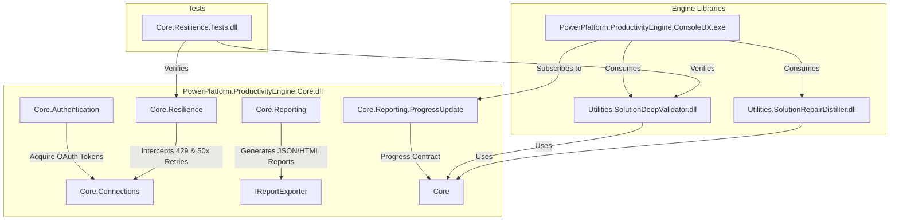

# Walkthrough - Power Platform Productivity Libraries and Console UX

This document walks you through the library-based architecture, subcommands, progress-reporting mechanisms, and execution details of the **Power Platform Productivity Utilities** suite.

---

## Architectural Layout



The codebase is organized into five projects under the `PowerPlatformProductivityEngine.sln` solution:

1. **`PowerPlatform.ProductivityEngine.Core`** (Class Library DLL): Provides client connectivity, multi-token MSAL caching, thread-safe Semaphore-locked HTTP 429 intercepts, and HTML/JSON reporting pipelines.
2. **`Utilities.SolutionDeepValidator`** (Class Library DLL): Analyzes solution packages in-memory, crawls target environment metadata via a paged crawler, and runs 19 validators.
3. **`Utilities.SolutionRepairDistiller`** (Class Library DLL): Handles direct-to-server solution distillation, repairs XML corruptions in local solution packages, and programmatically executes environment fixes.
4. **`PowerPlatform.ProductivityEngine.ConsoleUX`** (Console App CLI): The central command-line user interface. It parses command-line arguments and renders real-time, color-coded updates.
5. **`Core.Resilience.Tests`** (xUnit Test Project): Unit tests verifying HTTP throttling handlers, OData crawlers, validation engine rules, and XML log parsers.

---

## Progress Reporting Pattern (`IProgress<ProgressUpdate>`)

To allow decoupling between core logic and the Console UI, all operations publish real-time status updates via standard .NET `IProgress<ProgressUpdate>`. This enables the console application to render progress details, percentages, and warnings:

- **`validate`**: Displays steps for zip extraction, async staging polling, OData crawler queries, and validator checks.
- **`distill`**: Displays solution component fetches, OOB table detection, and distillation status.
- **`repair`**: Displays report reading, unmanaged layer removals, and missing dependency additions.

---

## Subcommand Execution Guide

Run the console application inside the workspace:

### 1. Solution Validation (`validate`)
Validates solution ZIP packages or source exported solutions against target environments:
```powershell
# Run validation demo simulation (generates JSON/HTML reports)
dotnet run --project PowerPlatform.ProductivityEngine.ConsoleUX -- validate --simulate

# Run against a live target environment
dotnet run --project PowerPlatform.ProductivityEngine.ConsoleUX -- validate --zip "C:\path\to\solution.zip" --url "https://myorg.crm.dynamics.com" --interactive
```

### 2. Solution Distillation (`distill`)
Optimizes OOB bloated entities on the source environment, or repairs XML corruptions in local ZIP files:
```powershell
# Run distillation demo simulation (direct-to-server check)
dotnet run --project PowerPlatform.ProductivityEngine.ConsoleUX -- distill --simulate

# Distill OOB table bloat directly on a live source environment
dotnet run --project PowerPlatform.ProductivityEngine.ConsoleUX -- distill --url "https://source.crm.dynamics.com" --solution "MySolution" --interactive
```

### 3. Programmatic Repairs (`repair`)
Parses a validation JSON report and programmatically executes repairs:
```powershell
# Run repair demo simulation
dotnet run --project PowerPlatform.ProductivityEngine.ConsoleUX -- repair --report validation_report.json --simulate
```

---

## Technical Bug Fixes and Enhancements (Completed)

We implemented five crucial fixes and naming corrections to align with Dataverse OData Web API restrictions and Windows CMD console encoding:

### 1. Case-Sensitive OData Payload Serialization
- **Root Cause**: HttpClient `PostAsJsonAsync` defaults to camelCase formatting. Dataverse OData actions and functions are strictly case-sensitive and expect PascalCase keys (e.g. `CustomizationFile` for `StageSolution` and `ComponentId` / `ComponentType` / `SolutionUniqueName` for component changes).
- **Fix**: Implemented class-level `PascalCaseJsonOptions` setting `PropertyNamingPolicy = null` and `DictionaryKeyPolicy = null`. Applied these options to all `PostAsJsonAsync` OData calls in `ValidationOrchestrator.cs`, `SolutionDistillerEngine.cs`, `SolutionPruner.cs`, and `SolutionRepairer.cs`. Renamed `SolutionPackage` to `CustomizationFile` on the StageSolution payload.

### 2. Relationship OData Subtype-Casting
- **Root Cause**: Querying the base `RelationshipDefinitions` OData endpoint with field selection fails because properties like `Entity1LogicalName` / `Entity2LogicalName` or `ReferencedEntity` / `ReferencingEntity` only exist on specific subtypes.
- **Fix**: Split relationship crawling in `TargetEnvironmentCrawler.cs` into two subtype-cast queries (`Microsoft.Dynamics.CRM.OneToManyRelationshipMetadata` and `Microsoft.Dynamics.CRM.ManyToManyRelationshipMetadata`) and merged their schemas in the cache.

### 3. WebResources Endpoint Rename
- **Root Cause**: Dataverse Web API exposes web resources via endpoint segment `webresourceset` instead of `webresources`.
- **Fix**: Updated `TargetEnvironmentCrawler.cs` query endpoint to `webresourceset?$select=webresourceid,name`.

### 4. Security Role Name Parsing & Fallbacks
- **Root Cause**: In `solution.xml`, security role components (Type 20) are declared with empty `schemaName`. The actual human-readable role name lives inside individual `Roles/**/*.xml` files in the solution ZIP.
- **Fix**: Implemented `ParseRoleFiles` in `SolutionPackagerWrapper.cs` to extract names from `Roles/*.xml` and map them back to components via GUIDs. Added a fallback display chain in `SecurityRoleValidator.cs` (`comp.Name ?? cacheMatch?.Name ?? comp.ComponentId`) to prevent blank names in reports.

### 5. Console UX Polish (ASCII & Absolute Path Outputs)
- **Root Cause**: Unicode emojis (`⚠️`, `✅`, `❌`) render as `?` in default Windows consoles (code page 437/1252). Also, output reports defaulted to relative paths, which could make them hard to locate.
- **Fix**: Replaced all emojis with standard ASCII brackets (e.g. `[PASSED]`, `[FAILED]`). Added a `PrintReportPaths` helper to resolve and print the absolute file system paths of the generated HTML/JSON reports.

---

## Verification Results Summary

### 1. Automated Tests Run
Unit tests compiled and executed successfully:
```text
Passed!  - Failed: 0, Passed: 7, Skipped: 0, Total: 7, Duration: 4 s - Core.Resilience.Tests.dll (net9.0)
```
- Includes 4 resilience retry/throttling handler checks.
- Includes 3 validator and log parser checks.

### 2. Demo Validation Output
Running the Validator in simulation mode generated a detailed failure summary (blockers count: 4, warnings count: 2, confidence score: Low) and outputted reports with absolute path resolution:
- **HTML Report**: `D:\OneDrive\OneDrive-Projects\Claude D365 Consulting\PowerPlatformUtilities\validation_report.html`
- **JSON Report**: `D:\OneDrive\OneDrive-Projects\Claude D365 Consulting\PowerPlatformUtilities\validation_report.json`
